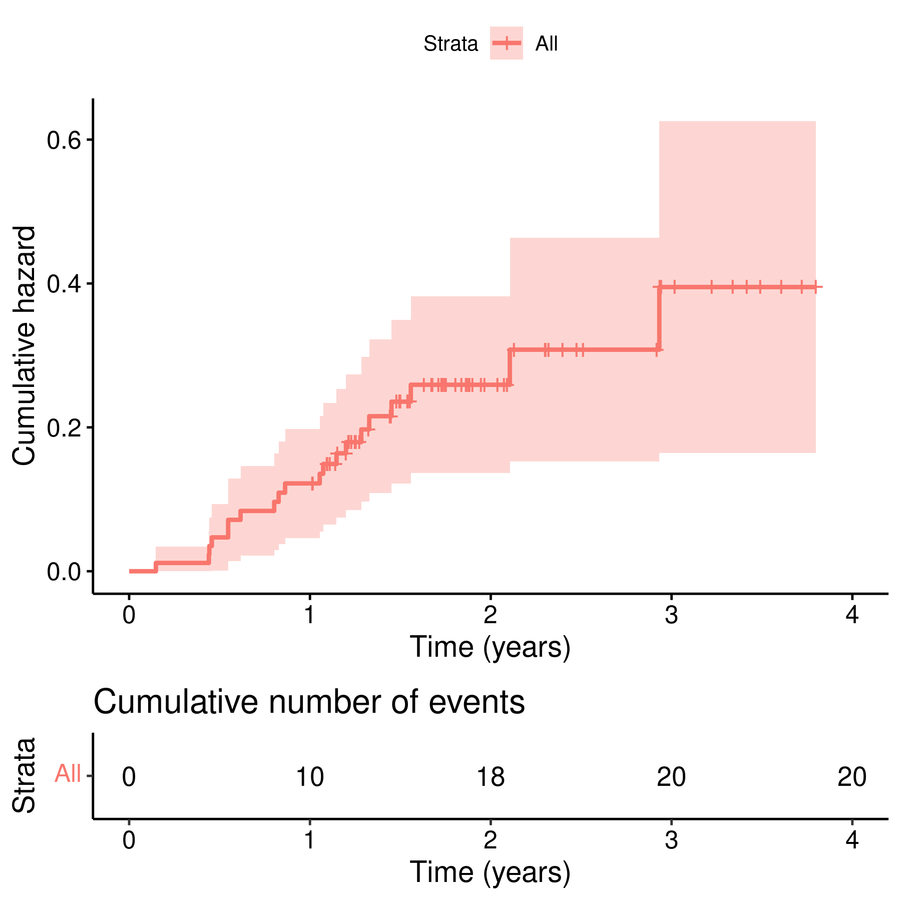
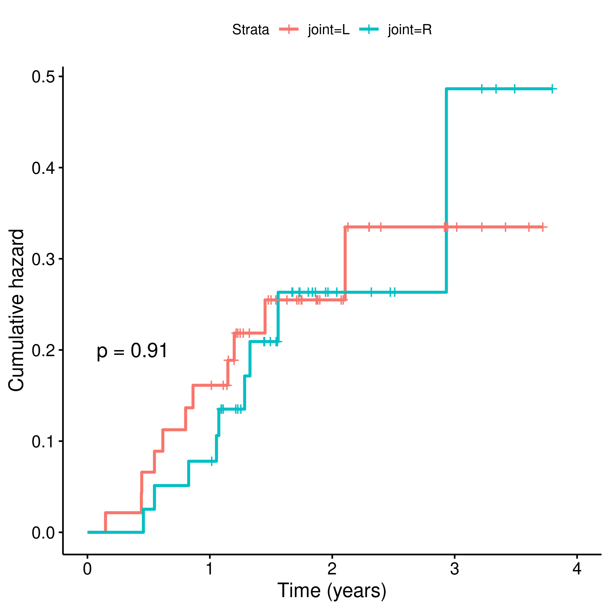

```{r setup, include=FALSE}
knitr::opts_chunk$set(echo = FALSE)
knitr::opts_knit$set(root.dir = normalizePath(".."))
options(scipen = 999)
library(pander)
library(knitr)
library(philsfmisc)
panderOptions('table.style', 'rmarkdown')
panderOptions('table.split.table', Inf)
```

---

**Document version**

```{r, echo = FALSE}
Version <- c("01")
Changes <- c("Initial version")
history <- cbind(Version, Changes)
colnames(history) <- c("Version", "Alterations")
# pander(history, split.cells = 70)
kable(history)
```

---

# Abbreviations

- BMI: body-mass index
- SD: standard deviation

# Introduction

## Objectives

## Data reception and cleaning

# Methods

```{r results, include=FALSE}
source("scripts/results.R", encoding = 'UTF-8')
```

## Variables

### Primary and secondary outcomes

### Covariates

## Statistical analyses

### Statistical packages

This analysis was performed using statistical software `R` version `r getRversion()`.
Packages used for survival analyses were `survival` version `r packageVersion("survival")` and `survminer` version `r packageVersion("survminer")`.

# Results

## Study population and follow up

The study population was composed of `r person_years$observations` participants, contributing to a total of `r round(person_years$pyears)` person-years of observation (Table 1).
Gender split was similar with 37 (43%) males and 50 (57%) females, with average (SD) age 61 (11) years.
The typical BMI observed was approximately 30 kg/m²
Twenty participants were smokers and the side of operation was approximately equally distributed in sides.

The prosthesis failure was detected in `r person_years$event` participants, accounting for approximately one quarter of the study population.

```{r}
desc_tab %>% as_kable()
```

Table: **Table 1** Patient characteristics.

## Time to prosthesis failure
```{r}
# summary(sf.1, times = 1:2)
# philsfmisc::format.pct(1-c(0.885,0.821,0.955), 0)
# philsfmisc::format.pct(1-c(0.793,0.712,0.883), 0)
```

Times to prosthesis failure ranged from 7 weeks to almost 3 years (Figure 1).
The total failure rate at the end of study follow up was 23% so the median time of failure could not be estimated.
After one year under observation the rate of failure was 12% (4% -- 18%), while after two years the estimated failure rate is 21% (12% -- 29%).
There were no significant differences among groups when comparing genders, smoking status or the knee side operated on (Table 2).

```{r survival table, warning=FALSE}
inf_tab %>% as_kable()
```

Table: **Table 2** Prosthesis failure probabilities after 2-years of follow up.
p-value: groups compared with the Log-rank test.



**Figure 1** Prosthesis loosening.

# Exceptions and Observations

# Conclusions

# References

# Appendix

## Exploratory data analysis


**Figure 2** Prostheses loosening by gender.


**Figure 3** Prosthesis loosening by smoking status.


**Figure 4** Prosthesis loosening by joint operated.

## Analytical data-set

Due to confidentiality the data-set used in this analysis cannot be shared online in the public version of this report.

```{r data}
# pander(dtmin)
```
