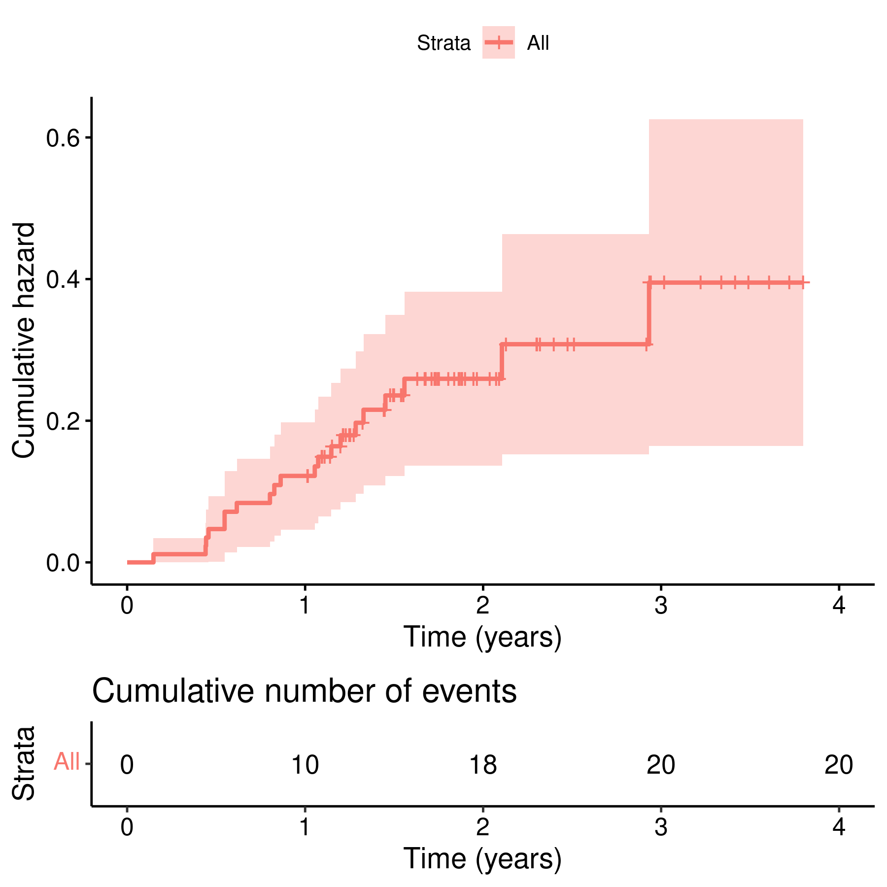
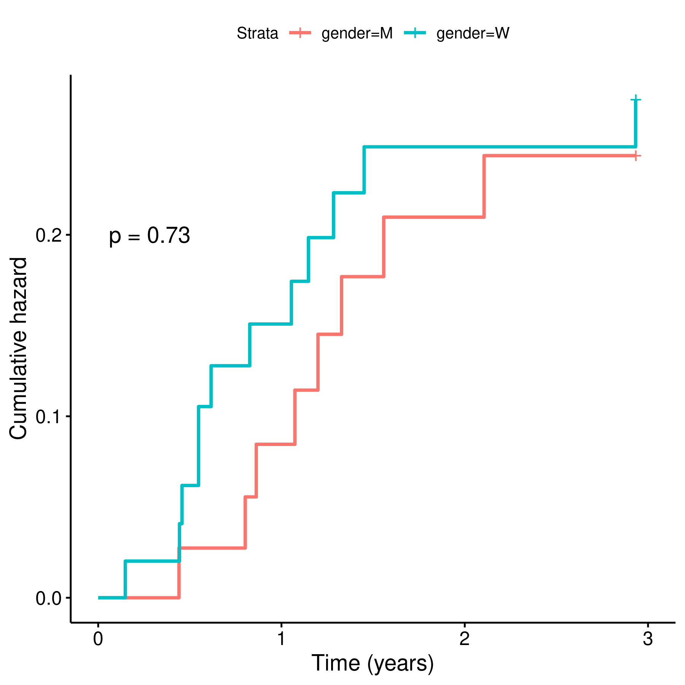
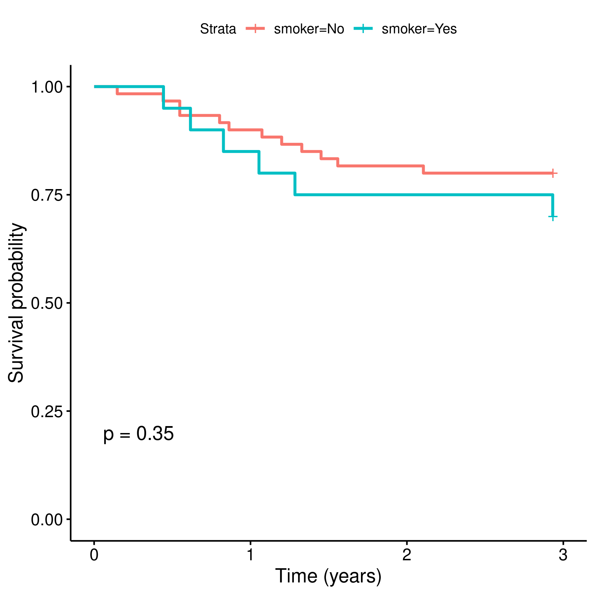
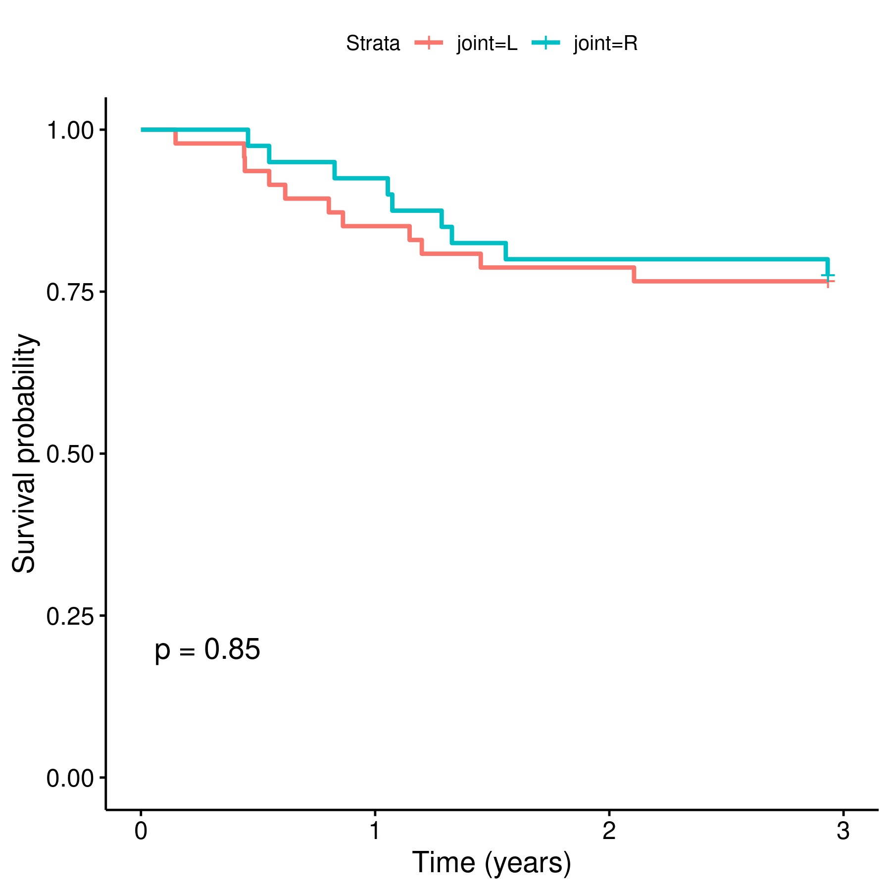

---

**Document version**

|Version |Alterations     |
|:-------|:---------------|
|01      |Initial version |

---

# Abbreviations

- BMI: body-mass index
- CI: 95% confidence interval
- SD: standard deviation

# Introduction

## Objective

Perform a time-to-failure analysis in a sample of knee prosthesis patient data from the Helios Klinikum Berlin-Buch hospitals

## Data reception and cleaning

The data were be pre-processed, rearranged and cleaned as follows:

- All variables were standardized
  - variable names were standardized for processing purposes, labels were attributed for reporting purposes;
  - observations were standardized according to variable type (numeric, dates, categorical, etc)
- All categorical variables were standardized according to their categories pre-defined in the dictionary provided
  - Gender: M/W
  - Smoking status: No/Yes
  - Joint: L/R
- All dates were standardized and invalid values removed
  - All invalid values like "xxxxxxxxxx",  "xxxxxxxxxxxxxxx", etc were removed before data processing;
- Age were computed as whole years between birth and first surgery, with calendar accuracy;

# Methods

## Variables

Upon inspection of the dates of first surgery and dates of loosening for individual patients, it appears the study period is delimited between 2017-05-10 and 2021-02-25, so these were the dates considered as study start and end.

### Primary and secondary outcomes

The event of interest in this analysis is the diagnosis of implant loosening.
The primary outcome was defined as the cumulative hazard of implant lossening, and computed with the Kaplan-Meier estimator.

The time until the event of interest was computed between the date of first surgery and date of implant loosening.
Patients that reached study end date without implant failure were censored.
Considering the study period of approximately 4 years, time under observation was measured in years.

### Covariates

Study outcomes were not adjusted for covariates like age, gender or BMI.

## Statistical analyses

Patient characteristics were described with frequency and proportion for categorical variables and mean (SD) for numerical variables.
The main study outcome (time-to-failure) was presented in a Kaplan-Meier plot.
Time-to-failure was cross-analyzed with all selected categorical variables, including gender, smoking status and joint.
Uni-variate analyses were performed using the log-rank test.
All analyses were performed using the significance level of 5%.
All significance hypothesis tests and confidence intervals computed were two-tailed.

### Statistical packages

This analysis was performed using statistical software `R` version 4.0.4.
Packages used for survival analyses were `survival` version 3.2.7 and `survminer` version 0.4.9.

# Results

## Study population and follow up

The study population was composed of 87 participants, contributing to a total of 217 person-years of observation (Table 1).
Gender split was similar with 37 (43%) males and 50 (57%) females, with average (SD) age 61 (11) years.
The typical BMI observed was approximately 30 kg/m²
Twenty participants were smokers and the side of operation was approximately equally distributed in sides.

The prosthesis failure was detected in 20 participants, accounting for approximately one quarter of the study population.

|**Characteristic** |**N = 87** |
|:------------------|:----------|
|Gender             |           |
|M                  |37 (43%)   |
|W                  |50 (57%)   |
|Age                |61 (11)    |
|BMI                |29.8 (3.9) |
|Smoker             |20 (25%)   |
|Unknown            |7          |
|Joint              |           |
|L                  |47 (54%)   |
|R                  |40 (46%)   |
|Post-op status     |           |
|Success            |67 (77%)   |
|Failure            |20 (23%)   |

Table: **Table 1** Patient characteristics.

## Time to prosthesis failure

Times to prosthesis failure ranged from 7 weeks to almost 3 years (Figure 1).
The total failure rate at the end of study follow up was 23% so the median time of failure could not be estimated.
After one year under observation the rate of failure was 12% (4% -- 18%), while after two years the estimated failure rate is 21% (12% -- 29%).
There were no significant differences among groups when comparing genders, smoking status or the knee side operated on (Table 2).

|**Characteristic** |2-year prosthesis failure |**p-value** |
|:------------------|:-------------------------|:-----------|
|Overall            |21% (12%, 29%)            |            |
|Gender             |                          |0.7         |
|M                  |19% (5.3%, 31%)           |            |
|W                  |22% (9.6%, 33%)           |            |
|Smoker             |                          |0.4         |
|No                 |18% (7.9%, 28%)           |            |
|Yes                |25% (3.4%, 42%)           |            |
|Joint              |                          |0.8         |
|L                  |21% (8.7%, 32%)           |            |
|R                  |20% (6.6%, 31%)           |            |

Table: **Table 2** Prosthesis failure probabilities after 2-years of follow up.
p-value: groups compared with the Log-rank test.

**Figure 1** Prosthesis loosening.

# Exceptions and Observations

# Conclusions

# References

- **SAP_analise_dados_JF_2021-v01** - Statistical Analysis Plan for Time until implant failure in a knee prosthesis sub-population of the Helios Klinikum Berlin-Buch hospitals

# Appendix

## Exploratory data analysis

**Figure 2** Prostheses loosening by gender.

**Figure 3** Prosthesis loosening by smoking status.

**Figure 4** Prosthesis loosening by joint operated.

## Analytical data-set

Due to confidentiality the data-set used in this analysis cannot be shared online in the public version of this report.

