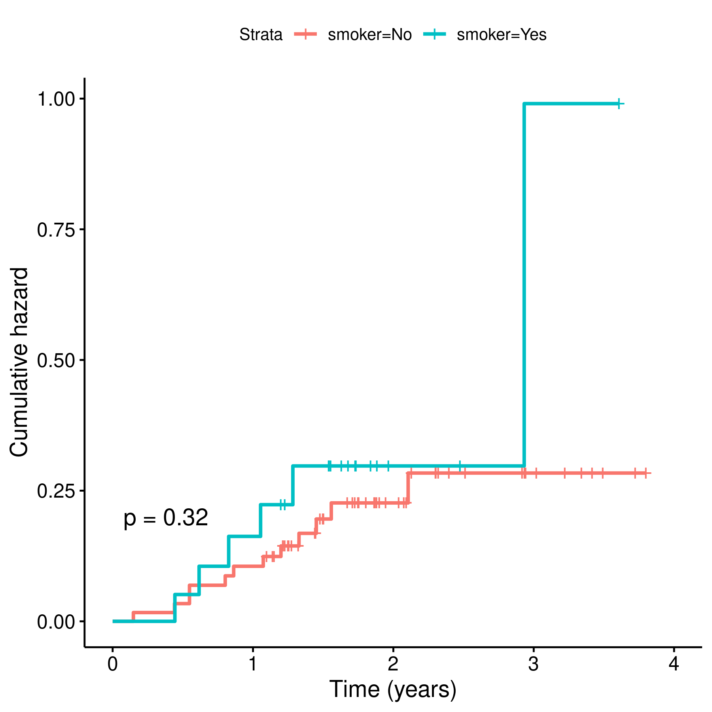

---

**Document version**

|Version |Alterations     |
|:-------|:---------------|
|01      |Initial version |

---

# Abbreviations

# Introduction

## Objectives

## Data reception and cleaning

# Methods

## Variables

### Primary and secondary outcomes

### Covariates

## Statistical analyses

### Statistical packages

This analysis was performed using statistical software `R` version 4.0.5.
Packages used for survival analyses were `survival` version 3.2.10 and `survminer` version 0.4.9.

# Results

## Study population and follow up

## Mortality

**Figure 1** Prosthesis loosening.

# Exceptions and Observations

# Conclusions

# References

# Appendix

## Exploratory data analysis

**Figure 2** Prostheses loosening by gender.

**Figure 3** Prosthesis loosening by smoking status.

**Figure 4** Prosthesis loosening by joint operated.

## Analytical data-set

Due to confidentiality the data-set used in this analysis cannot be shared online in the public version of this report.

