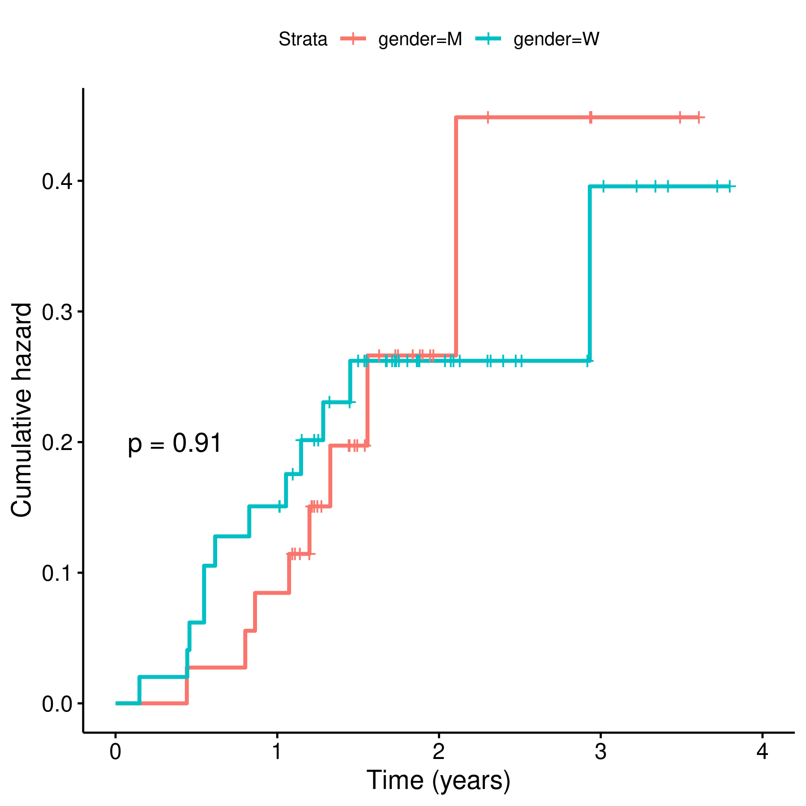

---

**Document version**

|Version |Alterations                                                                                                                                                                                             |
|:-------|:-------------------------------------------------------------------------------------------------------------------------------------------------------------------------------------------------------|
|01      |Initial version                                                                                                                                                                                         |
|02      |Operation time included in the analysis; minimum and maximum observations of numerical variables explicitly noted in the text; duplicate patients observed, and risk of bias noted in the Observations. |

---

# Abbreviations

- BMI: body-mass index
- CI: 95% confidence interval
- SD: standard deviation

# Introduction

## Objective

Perform a time-to-failure analysis to estimate implant loosening rates in a sample of knee prosthesis patient data from the Helios Klinikum Berlin-Buch hospitals

## Data reception and cleaning

The data were be pre-processed, rearranged and cleaned as follows:

- All variables were standardized
  - variable names were standardized for processing purposes, labels were attributed for reporting purposes;
  - observations were standardized according to variable type (numeric, dates, categorical, etc)
- All categorical variables were standardized according to their categories pre-defined in the dictionary provided
  - Gender: M/W
  - Smoking status: No/Yes
  - Joint: L/R
- All dates were standardized and invalid values removed
  - All invalid values like "xxxxxxxxxx",  "xxxxxxxxxxxxxxx", etc were removed before data processing;
- Age was computed as whole years between birth and first surgery, with calendar accuracy;

# Methods

## Variables

Upon inspection of the dates of first surgery and dates of loosening for individual patients, it appears the study period is delimited between 2017-05-10 and 2021-02-25, so these were the dates considered as study start and end.

### Primary and secondary outcomes

The event of interest in this analysis is the diagnosis of implant loosening.
The primary outcome was defined as the cumulative hazard of implant loosening, and computed with the Kaplan-Meier estimator.

The time until the event of interest was computed between the date of first surgery and date of implant loosening.
Patients that reached study end date without implant failure were censored.
Considering the study period of approximately 4 years, time under observation was measured in years.

### Covariates

Study outcomes were not adjusted for covariates like age, gender or BMI.

## Statistical analyses

Patient characteristics were described with frequency and proportion (%) for categorical variables and mean (SD) for numerical variables.
The main study outcome (time-to-failure) was presented in a Kaplan-Meier plot as well as the estimated failure rates and their corresponding CIs.
The failure rate was cross-analyzed with all available categorical variables, including gender, smoking status and joint.
Uni-variate analyses were performed using the log-rank test.
All analyses were performed using the significance level of 5%.
All significance hypothesis tests and confidence intervals computed were two-tailed.

### Statistical packages

This analysis was performed using statistical software `R` version 4.1.0.
Packages used for survival analyses were `survival` version 3.2.11 and `survminer` version 0.4.9.

# Results

## Study population and follow up

The study population was composed of 87 participants (Table 1).
Gender split was similar with 37 (43%) males and 50 (57%) females.
Participant ages ranged from 40 to 90 years with average (SD) age of 61 (11) years.
The average (SD) BMI observed was approximately 30 (4) kg/m² with a minimum of 20 and a maximum of 40.8 kg/m².
Average (SD) operation time was 68 (11) minutes with the shortest surgery lasting for 43 and the longest for 102 minutes.
Twenty participants were smokers and the side of operation was approximately equally distributed in sides.
Overall, the study population contributed to a total of 150 person-years of time under observation, ranging from 7 weeks to 3.8 years.
There were 5 bilateral cases, where patients had surgery on both knees.

|**Characteristic** |**N = 87** |
|:------------------|:----------|
|Gender             |           |
|M                  |37 (43%)   |
|W                  |50 (57%)   |
|Age                |61 (11)    |
|BMI                |29.8 (3.9) |
|Op. time (min)     |68 (11)    |
|Smoker             |20 (25%)   |
|Unknown            |7          |
|Joint              |           |
|L                  |47 (54%)   |
|R                  |40 (46%)   |
|Post-op status     |           |
|Success            |67 (77%)   |
|Failure            |20 (23%)   |

Table: **Table 1** Patient characteristics.

## Prosthesis loosening rates

Times to prosthesis loosening ranged from 7 weeks to 2.9 years (Figure 1).
Loosening events were observed in 20 (23%) of the included participants, accounting for approximately one quarter of the study population (Table 1).
The cumulative failure rate (CI) at the end of follow up was 33% (15% -- 46%).
Since the number of events was small, relative to the sample size, the median time of failure could not be estimated.

After one year under observation the rate of failure (CI) was 12% (4% -- 18%), while after two years the rate accumulated to 23% (13% -- 32%).
Table 2 summarizes the estimates for 3 years of follow up.
There were no significant differences among groups when comparing genders, smoking status or the knee side operated on.

|**Characteristic** |3-year prosthesis loosening |**p-value** |
|:------------------|:---------------------------|:-----------|
|Overall            |33% (15%, 47%)              |            |
|Gender             |                            |>0.9        |
|M                  |36% (3.3%, 58%)             |            |
|W                  |33% (8.7%, 50%)             |            |
|Smoker             |                            |0.3         |
|No                 |25% (10%, 37%)              |            |
|Yes                |63% (0%, 91%)               |            |
|Joint              |                            |>0.9        |
|L                  |28% (10%, 43%)              |            |
|R                  |39% (0.9%, 62%)             |            |

Table: **Table 2** Cumulative hazard of prosthesis loosening after 3 years of follow up.
p-value: groups compared with the Log-rank test.

**Figure 1** Cumulative hazard of prosthesis loosening.

# Exceptions and Observations

This analysis has the following limitations.
The time periods of the study were imputed by the statistician, based on inspection of the raw data.
This includes the putative censoring of cases not identified as having implant failures.
Since the Kaplan-Meier estimates rely heavily on the time to events, different definitions of study period could result in slightly different hazard estimates.
It is recommended that the results presented in this report be interpreted with caution, taking into account the details of the study design.

The results in this report should be interpreted with care.
The methods used considered that all observations were different participants but there were 5 bilateral cases, where a patient had surgery on both knees.
All results shown here are valid under the assumption of independence of observations, while multiple observations of a single patient could introduce bias in the estimates.
To account for these biases a multivariate analysis would be required to estimate the effect size of covariates in the risk of implant failure.

# Conclusions

The study cohort included 87 participants that were observed for a total period of 4 years.
After the first knee surgery 20 (23%) participants experienced implant failure, with times to failure ranging from 7 weeks to 3 years.
These events represent a raw estimate of cumulative hazard of implant loosening of 33% (15% -- 46%) in the study period.

# References

- **SAP_analise_dados_JF_2021-v01** - Statistical Analysis Plan for Implant failure rates in a knee prosthesis sub-population of the Helios Klinikum Berlin-Buch hospitals.

# Appendix

## Exploratory data analysis

**Figure 2** Prostheses loosening by gender.

**Figure 3** Prosthesis loosening by smoking status.

**Figure 4** Prosthesis loosening by joint operated.

## Analytical data-set

Due to confidentiality the data-set used in this analysis cannot be shared online in the public version of this report.

